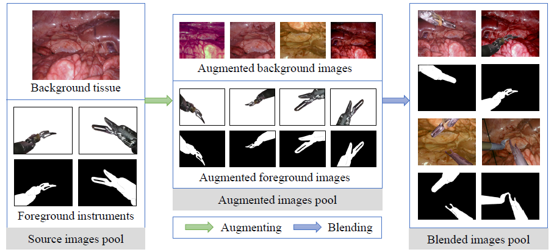

# Single_SurgicalScene_For_Segmentation

This is the Pytorch implementation for MICCAI2022 -

[**Rethinking Surgical Instrument Segmentation: A Background Image Can Be All You Need**](https://arxiv.org/abs/2206.11804)

An Wang*, Mobarakol Islam*, Mengya Xu, and Hongliang Ren**

*: First author; **: Corresponding author

> In this paper, we rethink the surgical instrument segmentation task and propose a one-to-many data generation solution that gets rid of the complicated and expensive process of data collection and annotation from robotic surgery. We only utilize a single surgical background tissue image and a few open-source instrument images as the seed images and apply multiple augmentation and blending techniques to synthesize amounts of image variations. In addition, we also introduce the chained augmentation mixing during training to further enhance the data diversities. The proposed approach can achieve decent surgical instrument segmentation performance compared with real dataset. Moreover, we also observe that our method can deal with novel instruments prediction in the deployment domain. We hope our inspiring results would encourage researchers to emphasize data-centric methods to overcome demanding deep learning limitations besides data shortage, such as class imbalance, domain adaptation, and incremental learning.



- [SingleSynSeg](#singlesynseg)
  - [Environments](#environments)
  - [Dataset Generation](#dataset-generation)
    - [Augmentation of background tissue image](#augmentation-of-background-tissue-image)
    - [Augmentation of foreground instruments images](#augmentation-of-foreground-instruments-images)
    - [Blending of composited training samples](#blending-of-composited-training-samples)
  - [Instruments Segmentation](#instruments-segmentation)
  - [Acknowledgements](#acknowledgements)
  - [Citation](#citation)

## Environments

* Python=3.8
* Pytorch=1.10
* torchvision=0.11.2
* cuda=11.3
* imgaug=0.4.0
* albumentations=1.1.0
* comet_ml=3.2.0 (used for experiments logging, remove where necessary if you don't need)
* Other commonly seen dependencies can be installed via pip/conda.

## Dataset Generation

### Augmentation of background tissue image
In ./data_gen/background/raw/, the source background tissue image is provided. Adapt `aug_bg.ipynb` to generate augmented background images.

### Augmentation of foreground instruments images
In ./data_gen/foreground/, different types of instruments with 3 image-mask pairs are provided (Note: there are 2 versions of Bipolar Forceps in Endovis-2018 dataset.). Adapt `aug_fg.ipynb` to generate augmented foreground images.

### Blending of composited training samples
In ./data_gen/blended/, adapt `blend_multi.ipynb` to generate the blended images used for training.

## Instruments Segmentation

To evaluate the quality of the generated synthetic dataset, binary instrument segmentation is adopted. 

Example commands:

1. Train with Synthetic-A
```
python3 train.py --train_dataset Blend --blend_mode paste_1bg_2base_1tool --val_dataset Endo18_test
```
2. Train with Synthetic-B
```
python3 train.py --train_dataset Blend --blend_mode paste_1bg_2base_12tool_2k --val_dataset Endo18_test
```
3. Train with Synthetic-C
```
python3 train.py --train_dataset Blend --blend_mode paste_1bg_3base_12tool_2k --val_dataset Endo18_test 
```

## Acknowledgements

Part of the codes are adapted from [robot-surgery-segmentation](https://github.com/ternaus/robot-surgery-segmentation).

## Citation
```
@misc{wang2022rethinking,
    title={Rethinking Surgical Instrument Segmentation: A Background Image Can Be All You Need},
    author={An Wang and Mobarakol Islam and Mengya Xu and Hongliang Ren},
    year={2022},
    eprint={2206.11804},
    archivePrefix={arXiv},
    primaryClass={cs.CV}
}
```
